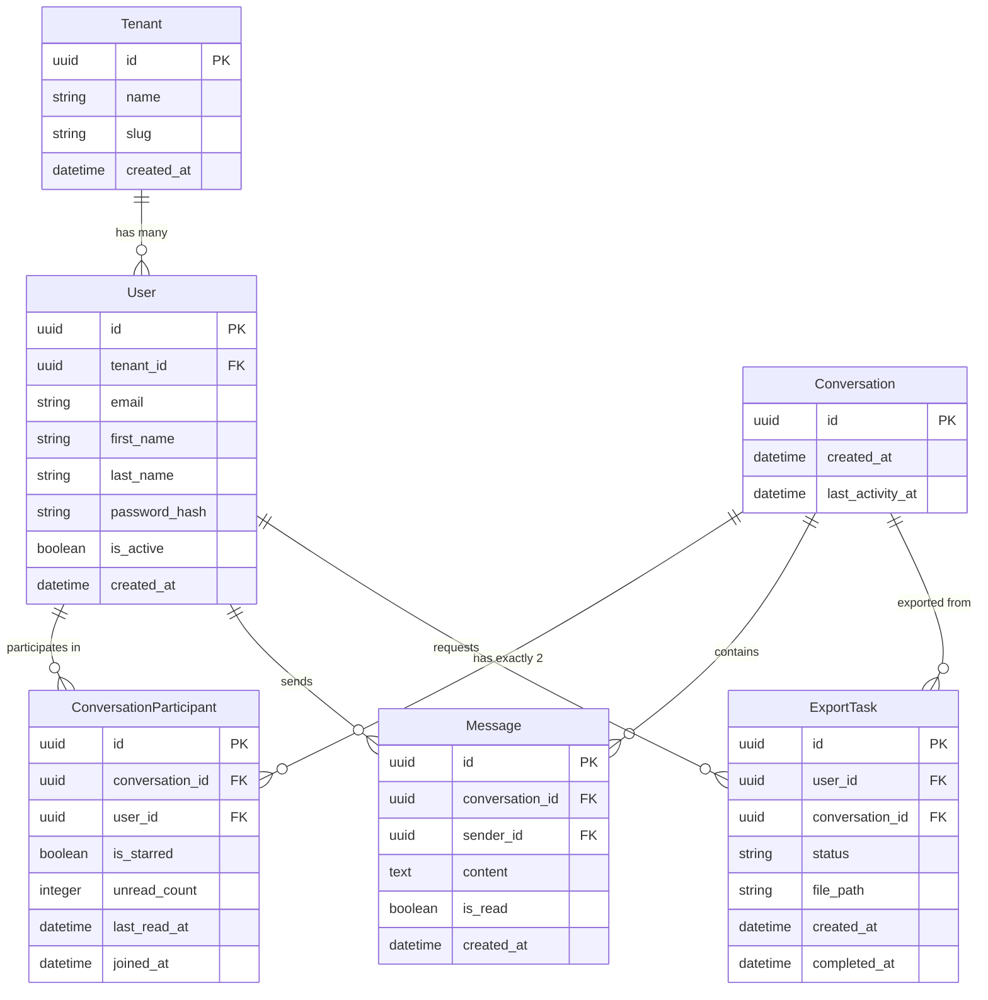
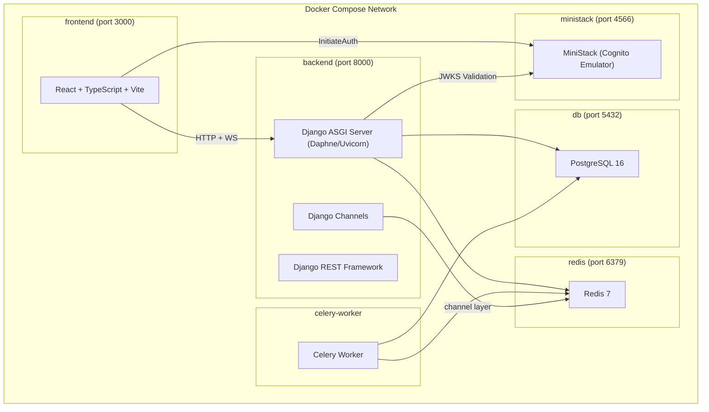
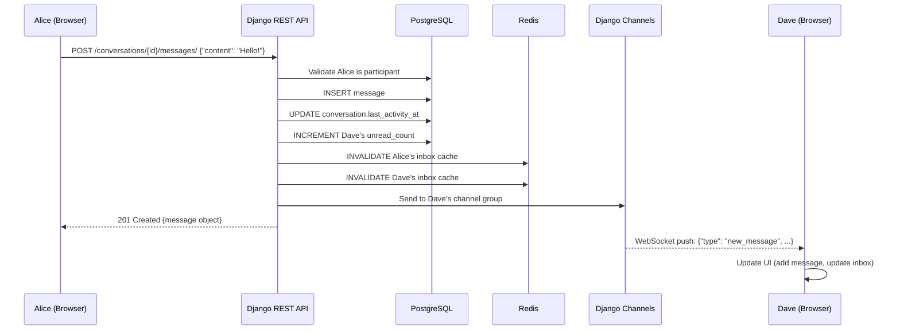
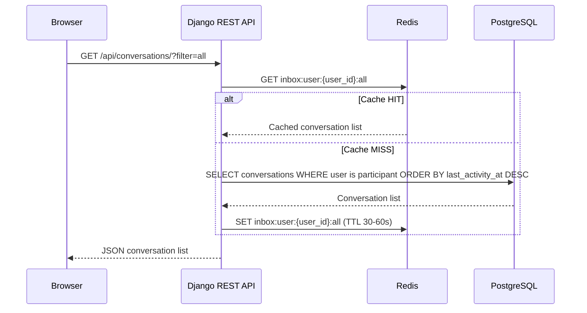
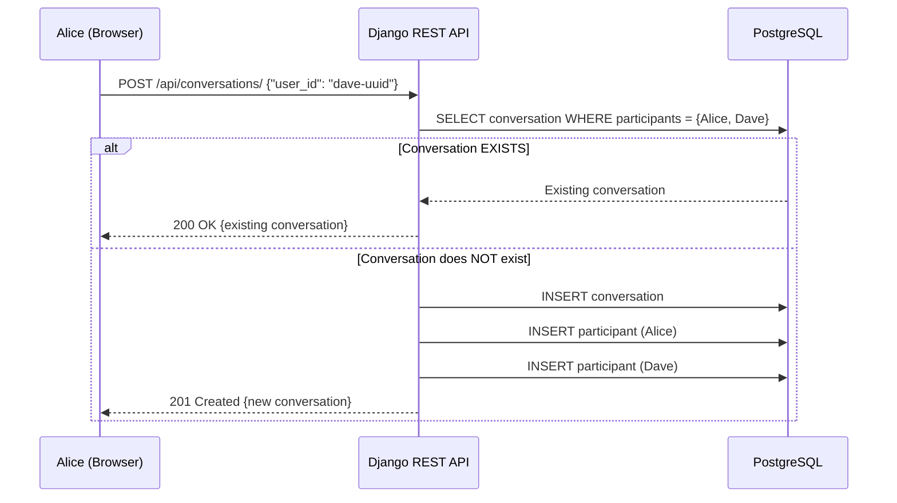
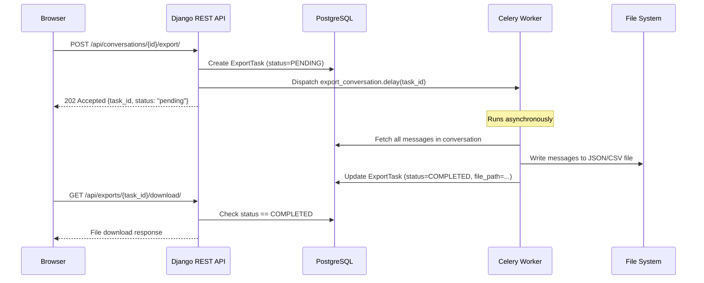
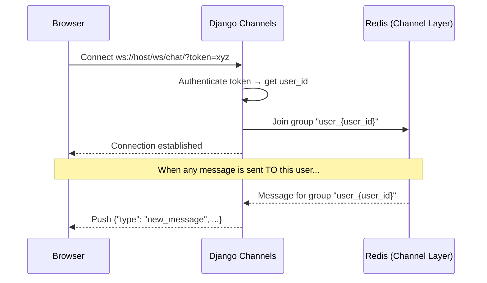
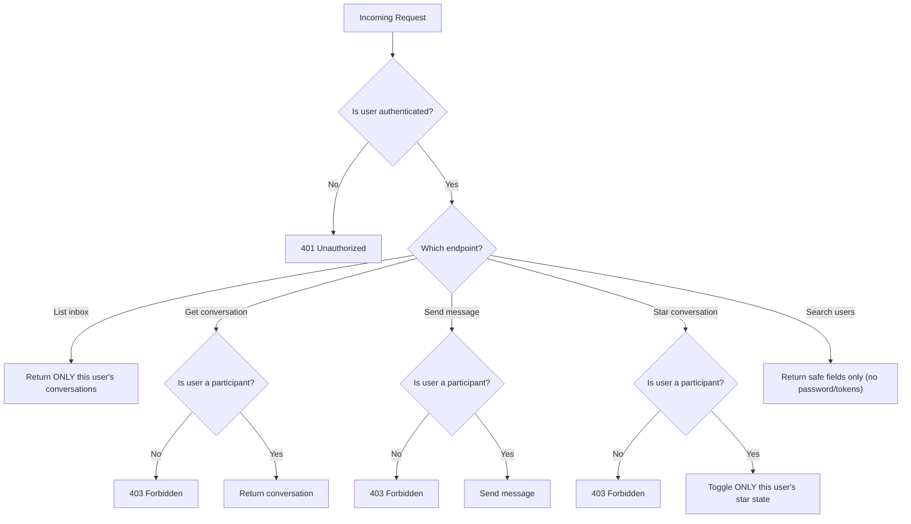
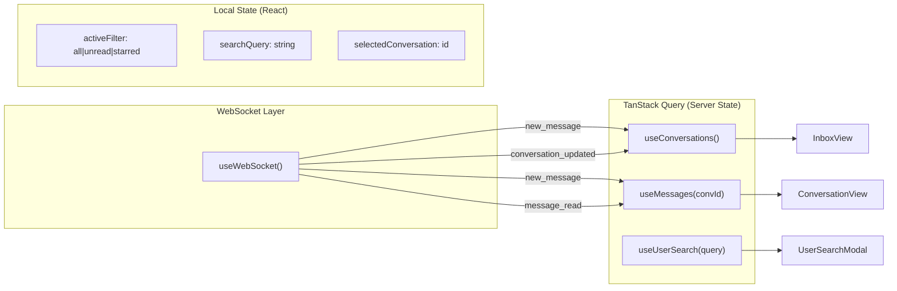

# Cross-Tenant Messaging Application — System Design & Architecture

---

## 1. High-Level Overview

This is a **real-time messaging application** where users from different organizations (tenants) can exchange direct messages. Think of it as a simplified Slack DM system, but where people from *Company A* can message people from *Company B*.

```
┌─────────────────────────────────────────────────────────────────┐
│                        BROWSER (React)                         │
│  ┌──────────┐   ┌──────────────────┐   ┌─────────────────────┐ │
│  │  Inbox   │   │  Conversation    │   │   User Search       │ │
│  │  View    │   │  View            │   │   (cross-tenant)    │ │
│  └────┬─────┘   └───────┬──────────┘   └──────────┬──────────┘ │
│       │                 │                         │            │
│       └────────┬────────┴─────────────────────────┘            │
│                │                                               │
│        ┌───────┴────────┐    ┌──────────────────┐              │
│        │  REST (HTTP)   │    │  WebSocket (WS)  │              │
│        └───────┬────────┘    └────────┬─────────┘              │
└────────────────┼──────────────────────┼────────────────────────┘
                 │                      │
 ─────────────────┼──────────────────────┼──── NETWORK ──────────
                 │                      │
┌────────────────┼──────────────────────┼────────────────────────┐
│                ▼                      ▼                        │
│  ┌──────────────────────┐  ┌─────────────────────────────┐    │
│  │   Django REST API    │  │   Django Channels (ASGI)    │    │
│  │   (DRF views)        │  │   (WebSocket consumers)     │    │
│  └──────────┬───────────┘  └──────────┬──────────────────┘    │
│             │                         │                        │
│             ▼                         ▼                        │
│  ┌─────────────────────────────────────────────────────┐      │
│  │              Django ORM / Business Logic            │      │
│  └──────┬───────────────────┬──────────────────────────┘      │
│         │                   │                                  │
│         ▼                   ▼                                  │
│  ┌──────────────┐   ┌──────────────┐   ┌────────────────┐    │
│  │  PostgreSQL  │   │    Redis     │   │    Celery       │    │
│  │  (data)      │   │  (cache +    │   │  (async tasks)  │    │
│  │              │   │   channels)  │   │                  │    │
│  └──────────────┘   └──────────────┘   └────────────────┘    │
│                          DOCKER COMPOSE                        │
└────────────────────────────────────────────────────────────────┘
```

**Authentication Flow (Cognito / MiniStack):**

```
┌──────────────┐     InitiateAuth / Refresh      ┌─────────────────────┐
│  React       │ ───────────────────────────────► │  MiniStack Cognito  │
│  Frontend    │ ◄── Access + Id + Refresh JWT ── │  :4566 (local)      │
└────────┬─────┘                                  │  or AWS Cognito     │
         │                                        └─────────────────────┘
         │ Authorization: Bearer <AccessToken>
         │ WS: ?token=<AccessToken>
         ▼
┌──────────────────┐     Validate JWT (JWKS)          ┌─────────────────────┐
│  Django / DRF    │ ◄── optionally Admin* APIs ─────► │  MiniStack Cognito  │
│  + Channels      │     (seed, disable user, etc.)   │                     │
│                  │                                   └─────────────────────┘
│  Local User row  │── cognito_sub → Cognito user
│  + Tenant FK     │── messaging FKs unchanged
└──────────────────┘
```

**In plain English:** The browser talks to the backend two ways — HTTP for regular actions (fetch inbox, send message, search users) and WebSocket for real-time updates (new messages appear instantly). The backend stores everything in PostgreSQL, caches hot data in Redis, and offloads slow jobs (like exporting a conversation to a file) to Celery workers.

---

## 2. Core Concepts Explained

### 2.1 What is a Tenant?

A **tenant** is an organization — like a company. Every user belongs to exactly one tenant.

```
Tenant: "Acme Corp"              Tenant: "Globex Inc"
├── alice@acme.com               ├── dave@globex.com
├── bob@acme.com                 ├── eve@globex.com
└── charlie@acme.com             └── frank@globex.com
```

The key feature: **Alice (Acme) can message Dave (Globex)**. This is cross-tenant messaging.

### 2.2 What is a Conversation?

A conversation is a **private 1-on-1 chat** between exactly two users. It is **idempotent** — if Alice and Dave already have a conversation, opening a new one just returns the existing one. There can never be two separate conversations for the same pair.

### 2.3 What is the Inbox?

The inbox is a user's **list of all their conversations**, sorted by the most recent activity. Each entry shows:
- Who they're talking to
- The last message preview
- When the last activity was
- Whether it's starred ⭐
- How many unread messages 🔴

---

## 3. Data Model (Database Design)

This is the heart of the system. Every box below becomes a PostgreSQL table.



### Why this design?

| Decision | Reason |
|---|---|
| **`ConversationParticipant` is a separate table** | Each user has their *own* starred state and unread count. Alice can star a conversation without affecting Dave. |
| **`Conversation` is its own table** (not embedded in messages) | We need to enforce "only one conversation per pair" and track metadata like `last_activity_at` for inbox sorting. |
| **`unread_count` on `ConversationParticipant`** | Avoids counting unread messages on every inbox load — we increment/decrement as messages arrive or are read. |
| **UUIDs as primary keys** | Prevents ID enumeration attacks and works well in distributed systems. |
| **`last_activity_at` on `Conversation`** | Allows fast `ORDER BY last_activity_at DESC` for the inbox without joining to messages. |
| **Unique constraint on `(user_id, conversation_id)` in `ConversationParticipant`** | Prevents a user from being added to the same conversation twice. |
| **Unique pair constraint on `Conversation`** | Enforced at the application level: before creating a conversation, check if one already exists for this user pair. Returns the existing one if found (idempotency). |

### Database Indexes

```
conversations          → INDEX on last_activity_at (inbox sorting)
conversation_participant → UNIQUE INDEX on (conversation_id, user_id)
conversation_participant → INDEX on (user_id) (find all my conversations)
messages               → INDEX on (conversation_id, created_at) (message history)
messages               → INDEX on (sender_id)
users                  → UNIQUE INDEX on (email)
users                  → INDEX on (tenant_id)
```

---

## 4. System Architecture — Component by Component

### 4.1 Docker Compose — What Runs Where



| Container | Image | Purpose |
|---|---|---|
| **frontend** | Node 20 + Vite | Serves the React app on port 3000 |
| **backend** | Python 3.12 + Daphne | Runs Django (both HTTP and WebSocket) on port 8000 |
| **db** | postgres:16 | Stores all persistent data |
| **redis** | redis:7 | Two roles: (1) cache for inbox, (2) channel layer for WebSocket pub/sub |
| **celery-worker** | Same image as backend | Processes async tasks (conversation export) |
| **ministack** | ministackorg/ministack | Local AWS Cognito emulator (User Pools, JWT, JWKS) on port 4566 |

### 4.2 Backend Architecture (Django)

```
backend/
├── config/                    # Django project settings
│   ├── settings.py
│   ├── urls.py
│   ├── asgi.py               # ASGI entry point (Channels + HTTP)
│   ├── wsgi.py
│   └── celery.py             # Celery app configuration
│
├── apps/
│   ├── tenants/              # Tenant model
│   │   ├── models.py
│   │   ├── serializers.py
│   │   └── admin.py
│   │
│   ├── users/                # User model + search API
│   │   ├── models.py         # Custom user extending AbstractUser
│   │   ├── serializers.py    # Excludes password, tokens
│   │   ├── views.py          # User search endpoint
│   │   └── urls.py
│   │
│   ├── conversations/        # Conversations + Participants
│   │   ├── models.py         # Conversation, ConversationParticipant
│   │   ├── serializers.py
│   │   ├── views.py          # Inbox, create/get conversation, star/unstar
│   │   ├── urls.py
│   │   ├── permissions.py    # IsParticipant permission class
│   │   └── cache.py          # Redis inbox caching logic
│   │
│   ├── messages/             # Messages within conversations
│   │   ├── models.py         # Message model
│   │   ├── serializers.py
│   │   ├── views.py          # Send, list, mark-read
│   │   ├── urls.py
│   │   └── consumers.py      # WebSocket consumer
│   │
│   └── exports/              # Celery export tasks
│       ├── models.py         # ExportTask model
│       ├── tasks.py          # Celery task: generate_export
│       ├── views.py          # Request export, download export
│       └── urls.py
│
├── routing.py                # WebSocket URL routing
├── middleware.py             # WebSocket auth middleware
└── manage.py
```

### 4.3 Frontend Architecture (React)

```
frontend/src/
├── main.tsx                   # Entry point
├── App.tsx                    # Router setup
│
├── api/                       # API client layer
│   ├── client.ts              # Axios instance with auth headers
│   ├── conversations.ts       # Conversation API calls
│   ├── messages.ts            # Message API calls
│   ├── users.ts               # User search API calls
│   └── exports.ts             # Export API calls
│
├── hooks/                     # Custom React hooks
│   ├── useConversations.ts    # TanStack Query: fetch inbox
│   ├── useMessages.ts         # TanStack Query: fetch messages
│   ├── useUserSearch.ts       # TanStack Query: search users
│   ├── useWebSocket.ts        # WebSocket connection + message handler
│   └── useExport.ts           # Export request + download
│
├── components/
│   ├── layout/
│   │   ├── AppLayout.tsx      # Sidebar + main area
│   │   └── Header.tsx
│   │
│   ├── inbox/
│   │   ├── InboxView.tsx      # Main inbox component
│   │   ├── ConversationItem.tsx  # Single conversation row
│   │   ├── InboxFilters.tsx   # All / Unread / Starred tabs
│   │   └── InboxSearch.tsx    # Search bar
│   │
│   ├── conversation/
│   │   ├── ConversationView.tsx  # Full chat view
│   │   ├── MessageBubble.tsx  # Single message
│   │   ├── MessageComposer.tsx   # Text input + send button
│   │   ├── MessageList.tsx    # Scrollable message list
│   │   └── EmptyState.tsx     # "No messages yet"
│   │
│   ├── users/
│   │   ├── UserSearch.tsx     # Search modal/panel
│   │   └── UserResult.tsx     # Single user result (shows tenant)
│   │
│   └── common/
│       ├── LoadingSpinner.tsx
│       ├── ErrorState.tsx
│       ├── UnreadBadge.tsx
│       └── StarIcon.tsx
│
├── contexts/
│   └── AuthContext.tsx        # Current user context
│
├── types/
│   └── index.ts               # TypeScript interfaces
│
└── utils/
    ├── formatTime.ts          # Relative time formatting
    └── websocket.ts           # WebSocket connection manager
```

---

## 5. API Design

### 5.1 REST Endpoints

| Method | Endpoint | Description | Auth |
|---|---|---|---|
| `GET` | `/api/auth/cognito-config/` | Get Cognito pool/client IDs for frontend | No |
| `GET` | `/api/auth/me/` | Get current user profile (after Cognito login) | Yes (Bearer) |
| `GET` | `/api/users/search/?q=alice` | Search users by name/email | Yes (Bearer) |
| `GET` | `/api/conversations/` | List inbox (cached) | Yes (Bearer) |
| `POST` | `/api/conversations/` | Create or get existing conversation | Yes (Bearer) |
| `GET` | `/api/conversations/{id}/` | Get conversation detail | Yes (Bearer, participant only) |
| `PATCH` | `/api/conversations/{id}/star/` | Toggle star | Yes (Bearer, participant only) |
| `GET` | `/api/conversations/{id}/messages/` | List messages (paginated) | Yes (Bearer, participant only) |
| `POST` | `/api/conversations/{id}/messages/` | Send a message | Yes (Bearer, participant only) |
| `POST` | `/api/conversations/{id}/messages/read/` | Mark messages as read | Yes (Bearer, participant only) |
| `POST` | `/api/conversations/{id}/export/` | Request async export | Yes (Bearer, participant only) |
| `GET` | `/api/exports/{id}/download/` | Download completed export | Yes (Bearer) |

> **Note:** The legacy `POST /api/auth/login/` (DRF Token) endpoint is retained during migration but deprecated. Frontend uses Cognito `InitiateAuth` directly against MiniStack/AWS, then calls `GET /api/auth/me/` to fetch the local user profile.

### 5.2 Query Parameters for Inbox

```
GET /api/conversations/?filter=all|unread|starred&search=hello&ordering=-last_activity_at
```

### 5.3 WebSocket Endpoint

```
ws://localhost:8000/ws/chat/?token=<cognito_access_token>
```

A single WebSocket connection per user. The server validates the Cognito Access JWT (or legacy DRF Token during migration) and pushes events to the user's personal channel group `user_{user_id}`.

**WebSocket Messages (Server → Client):**

```jsonc
// New message received
{
    "type": "new_message",
    "data": {
        "conversation_id": "uuid",
        "message": {
            "id": "uuid",
            "sender_id": "uuid",
            "sender_name": "Alice",
            "content": "Hello!",
            "created_at": "2026-09-24T10:00:00Z",
            "is_read": false
        }
    }
}

// Message read receipt
{
    "type": "message_read",
    "data": {
        "conversation_id": "uuid",
        "reader_id": "uuid",
        "read_at": "2026-09-24T10:01:00Z"
    }
}

// Conversation updated (star, new message count)
{
    "type": "conversation_updated",
    "data": {
        "conversation_id": "uuid",
        "last_message": "Hello!",
        "last_activity_at": "2026-09-24T10:00:00Z",
        "unread_count": 3
    }
}
```

---

## 6. Key Flows (Step by Step)

### 6.1 Sending a Message

This is the most important flow. Here's exactly what happens when Alice sends "Hello!" to Dave:



**Why this order matters:**
1. We save to PostgreSQL **first** (source of truth).
2. We invalidate the cache so the next inbox fetch gets fresh data.
3. We push via WebSocket so Dave sees it **instantly** without polling.
4. Alice gets the response and adds the message to her own UI.

### 6.2 Opening the Inbox



### 6.3 Starting a Conversation (Idempotent)



> [!IMPORTANT]
> **Idempotency**: No matter how many times Alice clicks "Message Dave", only one conversation is ever created. The backend checks for an existing pair first.

### 6.4 Conversation Export (Celery)



### 6.5 Real-Time WebSocket Connection



---

## 7. Authorization Model

Every API endpoint enforces strict access control:



**Key rules:**
- You **never** see another user's inbox.
- You **cannot** send messages in conversations you're not part of.
- Starring is **per-user** — Alice starring a conversation doesn't star it for Dave.
- User search returns only `id`, `email`, `first_name`, `last_name`, `tenant_name` — never passwords or tokens.

---

## 8. Caching Strategy (Redis)

### What We Cache

| Cache Key Pattern | Data | TTL | Invalidated When |
|---|---|---|---|
| `inbox:{user_id}:all` | Full inbox conversation list | 30-60s | User sends/receives message, stars/unstars |
| `inbox:{user_id}:unread` | Unread-only inbox | 30-60s | Same as above |
| `inbox:{user_id}:starred` | Starred-only inbox | 30-60s | Same as above |

### Cache Invalidation Strategy

```python
def invalidate_inbox_cache(user_id: str):
    """Called whenever a user's inbox state changes."""
    cache.delete_many([
        f"inbox:{user_id}:all",
        f"inbox:{user_id}:unread",
        f"inbox:{user_id}:starred",
    ])
```

**When to invalidate:**
- A new message is sent (invalidate both sender's and receiver's cache)
- A message is marked as read (invalidate that user's cache)
- A conversation is starred/unstarred (invalidate that user's cache)
- A new conversation is created (invalidate both participants' cache)

> [!NOTE]
> PostgreSQL is always the source of truth. If the cache is empty, we query PostgreSQL and re-populate the cache. The cache just reduces database load on frequently accessed inbox data.

---

## 9. Real-Time Architecture (WebSocket)

### How It Works

```
                          ┌─────────────────────────────────┐
                          │         Redis Pub/Sub           │
                          │     (Channel Layer Backend)     │
                          │                                 │
                          │  Groups:                        │
                          │  ┌─────────────────────────┐   │
                          │  │ "user_alice-uuid"        │   │
                          │  │ "user_dave-uuid"         │   │
                          │  │ "user_bob-uuid"          │   │
                          │  └─────────────────────────┘   │
                          └──────────┬──────────────────────┘
                                     │
                    ┌────────────────┼────────────────┐
                    │                │                │
              ┌─────┴─────┐   ┌─────┴─────┐   ┌─────┴─────┐
              │  Alice's  │   │  Dave's   │   │  Bob's    │
              │  Browser  │   │  Browser  │   │  Browser  │
              │  (WS)     │   │  (WS)     │   │  (WS)     │
              └───────────┘   └───────────┘   └───────────┘
```

- Each user joins a **personal channel group**: `user_{user_id}`
- When a message is sent, the server pushes to the **recipient's group**
- The recipient's browser receives the event and updates the UI
- **No polling** — updates are instant

### Preventing Duplicate Messages

When Alice sends a message:
1. Alice's browser **optimistically adds** the message to the UI (from the HTTP response)
2. If Alice has the conversation open, she does NOT get a WebSocket push for her own message
3. Dave gets a WebSocket push with the new message
4. When either user refetches messages, the `message.id` is used to **deduplicate** — if a message with that ID already exists in the local state, it's skipped

---

## 10. Frontend State Management



**How WebSocket and TanStack Query work together:**

```typescript
// When a WebSocket message arrives:
function handleWebSocketMessage(event: WSEvent) {
  if (event.type === 'new_message') {
    // Update the messages cache for this conversation
    queryClient.setQueryData(
      ['messages', event.data.conversation_id],
      (old) => deduplicateAndAppend(old, event.data.message)
    );
    // Invalidate inbox to refresh unread counts
    queryClient.invalidateQueries(['conversations']);
  }
}
```

---

## 11. Security Considerations

| Concern | Solution |
|---|---|
| **Authentication** | **Cognito Access Token (JWT, Bearer)**. Frontend authenticates via Cognito `InitiateAuth` (USER_PASSWORD_AUTH), receives Access/ID/Refresh tokens. Django validates JWT via JWKS from Cognito/MiniStack. Legacy DRF Token auth retained during migration. |
| **Participant-only access** | Custom DRF permission: `IsConversationParticipant`. Checked on every conversation/message endpoint. |
| **User data leakage** | User search serializer explicitly lists safe fields. Password, token fields are never serialized. |
| **Cross-tenant safety** | Cross-tenant messaging is allowed, but only after explicitly selecting a user. No "broadcast to all" capability. |
| **WebSocket auth** | Cognito Access Token (or legacy DRF Token) passed as query parameter `?token=`. Validated in custom middleware before the consumer runs. |
| **Idempotent conversations** | Database-level check prevents duplicate conversations for the same user pair. |
| **Token storage** | Access tokens in memory; Refresh tokens in HttpOnly cookie or secure localStorage. GlobalSignOut on logout. |
| **JWT validation** | Signature verification via JWKS (skipped for MiniStack stub tokens via `COGNITO_VERIFY_JWT=false`). Claims checked: `exp`, `iss`, `aud`/`client_id`, `token_use`. |

---

## 12. Seed Data

```
Tenant: "Acme Corp" (slug: acme)
├── alice@acme.com    (password: Password123!)
├── bob@acme.com      (password: Password123!)
└── charlie@acme.com  (password: Password123!)

Tenant: "Globex Inc" (slug: globex)
├── dave@globex.com   (password: Password123!)
├── eve@globex.com    (password: Password123!)
└── frank@globex.com  (password: Password123!)
```

> **Note:** Seed passwords are Cognito-compliant (min 8 chars, uppercase, lowercase, number, symbol). Override with `SEED_PASSWORD` env var.

Pre-seeded conversations:
- Alice ↔ Bob (same tenant)
- Alice ↔ Dave (cross-tenant ⚡)
- Bob ↔ Eve (cross-tenant ⚡)

Each with a few sample messages.

Both Cognito users (in MiniStack/AWS) and local Django users are created/linked via `bootstrap_cognito` and `seed` management commands.

---

## 13. Testing Strategy

```
tests/
├── test_models.py                # Model constraints, unique pairs
├── test_conversations_api.py     # Inbox, create, star, idempotency
├── test_messages_api.py          # Send, list, mark read
├── test_permissions.py           # Participant-only, no cross-user access
├── test_user_search.py           # Search results, safe fields only
├── test_cache.py                 # Cache hit/miss, invalidation
├── test_websocket.py             # WebSocket connect, receive message
└── test_export.py                # Celery task execution, file download
```

**Critical test cases:**
1. User A cannot see User B's inbox
2. User A cannot send messages in a conversation they're not in
3. User A starring a conversation doesn't affect User B's star state
4. Creating a conversation for an existing pair returns the same conversation
5. User search never returns password fields
6. Cross-tenant messaging works
7. WebSocket delivers messages to the correct user
8. Cache is invalidated after a new message

---

## 14. Docker Compose Service Map

```yaml
# Simplified view of docker-compose.yml
services:
  db:
    image: postgres:16
    ports: ["5432:5432"]
    volumes: [postgres_data:/var/lib/postgresql/data]

  redis:
    image: redis:7-alpine
    ports: ["6379:6379"]

  ministack:
    image: ministackorg/ministack:latest
    ports: ["4566:4566"]
    environment:
      - PERSIST_STATE=1
    volumes:
      - ministack_state:/tmp/ministack-state
    healthcheck:
      test: ["CMD", "python", "-c", "import urllib.request; urllib.request.urlopen('http://localhost:4566/_ministack/health')"]
      interval: 10s
      timeout: 5s
      retries: 5

  backend:
    build: ./backend
    command: >
      sh -c "python manage.py bootstrap_cognito &&
             python manage.py migrate &&
             python manage.py seed || true &&
             daphne -b 0.0.0.0 -p 8000 config.asgi:application"
    ports: ["8000:8000"]
    environment:
      - DATABASE_URL=postgres://user:pass@db:5432/messaging
      - REDIS_URL=redis://redis:6379/0
      - CELERY_BROKER_URL=redis://redis:6379/1
      - AWS_ENDPOINT_URL=http://ministack:4566
      - AWS_REGION=us-east-1
      - COGNITO_VERIFY_JWT=false
    depends_on:
      db:
        condition: service_healthy
      redis:
        condition: service_healthy
      ministack:
        condition: service_healthy

  celery-worker:
    build: ./backend
    command: celery -A config worker -l info
    environment:
      - DATABASE_URL=postgres://user:pass@db:5432/messaging
      - REDIS_URL=redis://redis:6379/0
      - CELERY_BROKER_URL=redis://redis:6379/1
      - AWS_ENDPOINT_URL=http://ministack:4566
      - AWS_REGION=us-east-1
    depends_on:
      db:
        condition: service_healthy
      redis:
        condition: service_healthy
      ministack:
        condition: service_healthy

  frontend:
    build: ./frontend
    ports: ["3000:3000"]
    environment:
      - VITE_AWS_ENDPOINT_URL=/aws-cognito
      - VITE_AWS_REGION=us-east-1
    depends_on:
      - backend
      - ministack

volumes:
  postgres_data:
  ministack_state:
```

---

## 15. Technology Justification

| Technology | Why We Use It |
|---|---|
| **Django** | Mature, batteries-included web framework. Great ORM, migrations, admin panel. |
| **Django REST Framework** | Industry standard for building REST APIs in Django. Serializers, viewsets, permissions. |
| **Django Channels** | Extends Django to handle WebSocket connections via ASGI. Integrates seamlessly with existing Django auth. |
| **PostgreSQL** | Reliable relational database. Strong support for UUIDs, JSON, and complex queries. Our source of truth. |
| **Redis** | Blazing-fast in-memory store. Dual role: (1) cache inbox queries for 30-60s, (2) channel layer for WebSocket pub/sub between server processes. |
| **Celery** | Distributed task queue. Handles the async export job without blocking the HTTP response. |
| **React + TypeScript** | Type-safe component-based UI. Large ecosystem, great DX. |
| **TanStack Query** | Manages server state (caching, refetching, optimistic updates). Pairs perfectly with WebSocket invalidation. |
| **Tailwind CSS** | Utility-first CSS framework. Fast to build responsive UIs without writing custom CSS files. |
| **Docker Compose** | One command (`docker compose up`) runs the entire stack. Reproducible across dev machines. |
| **MiniStack** | Local AWS Cognito emulator (User Pools, JWT, JWKS, OAuth2/OIDC). Enables full Cognito integration testing without AWS account. |
| **Amazon Cognito** | Managed identity provider. Handles auth flows (login, refresh, logout, MFA), issues JWTs. Django validates via JWKS. |

---

## 16. Summary — How Everything Connects

```
User opens app
  → React loads
  → Clicks "Sign In" → Redirects to Cognito (MiniStack) login
  → Enters email/password → Cognito returns Access + ID + Refresh JWTs
  → Frontend stores tokens, calls GET /api/auth/me/ → Gets local user profile
  → Opens WebSocket connection with ?token=<access_token> (joins personal channel)
  → Fetches inbox via REST (cached in Redis, sourced from PostgreSQL)
  → Clicks a conversation → fetches messages via REST
  → Types a message → POST to REST API (Authorization: Bearer <access_token>)
      → Django validates JWT via JWKS from Cognito/MiniStack
      → Saved to PostgreSQL
      → Inbox cache invalidated in Redis
      → WebSocket pushes to recipient via Redis channel layer
  → Recipient sees message instantly (no page refresh)
  → Stars a conversation → PATCH to REST API
      → Only their participant record updated
  → Requests export → Celery picks it up → file ready for download
  → Logout → Frontend calls GlobalSignOut + clears local tokens
```

This architecture is:
- **Scalable**: Redis caching reduces DB load; Celery offloads heavy work
- **Real-time**: WebSocket via Django Channels + Redis pub/sub
- **Secure**: Participant-only permissions at every layer; Cognito handles auth
- **Simple to deploy**: Single `docker compose up` command (includes MiniStack)
